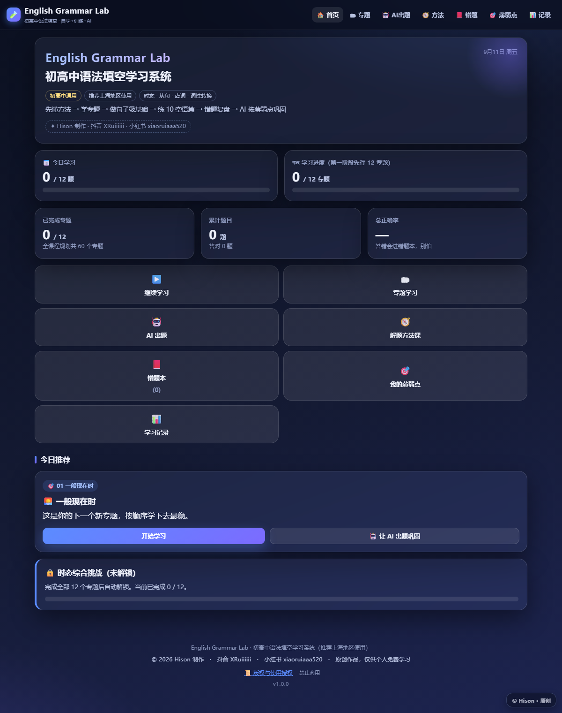

# English Grammar Lab

一个用浏览器打开就能做语法填空的练习工具。内容按上海卷的题型和考点整理，初高中都能用，默认从高一基础开始。



## 怎么用

下载根目录的 `English-Grammar-Lab.html`，双击打开就能做题。CSS、JS、题库全内联在这一个文件里，不用装任何东西，断网也能用（只有 AI 出题需要联网）。

- 做题记录、错题、分数都存在你自己浏览器的 localStorage 里，不会传到任何服务器。换浏览器或清缓存前，去「学习记录 → 数据管理」导出备份。
- AI 出题要填你自己的 DeepSeek API Key，默认只留在当前页面；勾了「记住」才会存到本机，页面上随时能清除。不填 Key 也不影响做内置题库。
- 它是纯前端工具，没有账号系统，别拿它当多人在线考试用。

第一次打开会弹一次版权说明，点「我已知晓」关掉就行。

## 里面有什么

考点按 11 个大专题组织：谓语动词、非谓语动词、词性转换、定语从句、名词性从句、状语从句、介词、冠词、代词、并列与逻辑、其他拓展。首页可以在高一/高二/高三之间切换，高一先看基础，高二高三再上综合。

- **内置题库**：谓语动词·时态 01–12 十二个专题，每个专题 12 道核心题加 6 道扩展题，另有 20 道时态综合挑战（12 个专题做完后解锁）。其他大专题没有内置题目，配合 AI 出题用。
- **解题方法课**：把做题顺序拆成 5 步——先通读，给词先问要不要谓语，无词先问句子完不完整，再判断从句成分，最后快速复查；另外整理了五个高频陷阱。
- **知识卡**：每个专题一张，写清一句话理解、术语、判断流程、最容易错的地方和例句。
- **解析**：每题都有判断链、为什么是这个答案、为什么其他答案不合适、一句话记忆，还有一句「如果你在考试现场」该怎么处理。解析默认折叠，不提前剧透。
- **练习**：句子级有普通模式（做完一题立刻看解析）和盲做模式（一轮做完再对答案）。AI 生成的语篇是 10 空一篇，做完进同一套判分流程。做错的题自动进错题本，按大专题统计，首页能看到自己的薄弱点。

## 自己改

源码在 `src/`，题库在 `data/`，根目录那个 HTML 是构建产物——改完源码一定要重新构建，否则成品和源码会对不上。

```
npm run build       # 重新生成 English-Grammar-Lab.html
npm test            # 题库结构 + 引擎 + 练习流程 + DOM 渲染 + AI 转换
npm run test:build  # 检查成品文件完整性
```

需要 Node 18 以上，没有第三方依赖，不用 `npm install`。

新增内置专题：照 `spec/DATA_SCHEMA.md` 写一个 `data/bank-*.js`，再到 `data/curriculum.js` 里登记它属于哪个大专题、哪个年级。界面部分在 `src/ui-*.js`（视图、练习、AI 出题），引擎在 `src/core.js`，AI 相关逻辑在 `src/ai.js`。

## 版权

个人免费自学使用，禁止任何商业用途——培训机构或补课班授课、付费课程与讲义、付费社群引流、二次售卖都不行；转发请保留署名、水印和授权说明。完整条款见 [LICENSE](LICENSE)，也可以点页面右下角的印章或页脚「版权与使用授权」查看。

题库、方法课和解析都是原创整理的，引用请注明出处（Hison · 抖音 XRuiiiiii · 小红书 xiaoruiaaa520）。题目或解析有问题、想提改进建议，欢迎开 Issue；想动手改代码可以先看 [CONTRIBUTING.md](CONTRIBUTING.md)。
